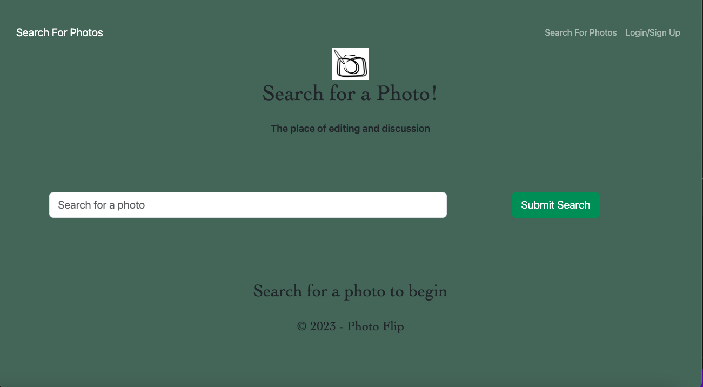

# Photo Flip

## Description

Photo Flip is a free space to post or edit any photo or meme you would like to! This application allows you to grab a photo link post it to our site with a description for anyone to see and comment on. This application is a better alternative to freely post photos without the added societal pressure of  big social media platform like instagram. Also any image you post can be flipped, which adds a fun element to posting your creations and cultivating a community of creatives within this application space. In a way this application can be a artistic environment for people to post and even battle with any photo they choose using this Photo Flip app.

Our motivation for developing Photo flip was to create fun new way application to post cool, funny and or interesting photos. Lyell originally came up with this idea to do a photoshop battle online and through that we created Photo which allows a user to essentially flip any photo they want to post on our application. A user will sign up, create a post by pasting in a link to a photo they have already edited, give it a title, add a description and post. It will appear on the home page and a feed will be on their page when creating a post. A user can then leave a comment underneath any photo. The battle part of it will be to take the photo posted from another user and creating a new edit to it, where others can comment on the flipped version of someone else photo. 

## Table of Contents 

- [Installation](#installation)
- [Usage](#usage)
- [Credits](#credits)
- [License](#license)

## Installation

What are the steps required to install your project? Provide a step-by-step description of how to get the development environment running.

## Usage

A user will sign up, create a post by pasting in a link to a photo they have already edited, give it a title, add a description and post. It will appear on the home page and a feed will be on their page when creating a post. A user can then leave a comment underneath any photo. The battle part of it will be to take the photo posted from another user and creating a new edit to it, where others can comment on the flipped version of someone else photo. 

Demo: 
    

## Credits

Collaborators GitHub profiles:
[Lyell](https://github.com/lcurtis0)
[Greg](https://github.com/dopalescent)
[Dmitry](https://github.com/Unk171)
[Sedia](https://github.com/SediaM)

## License

## Deployment:

Heroku Deployed URL:

GitHub Deployed URL: https://sediam.github.io/PhotoShopIt/
